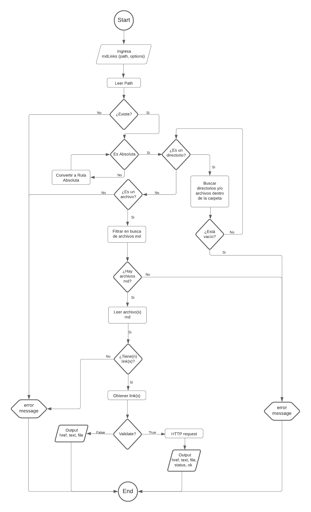
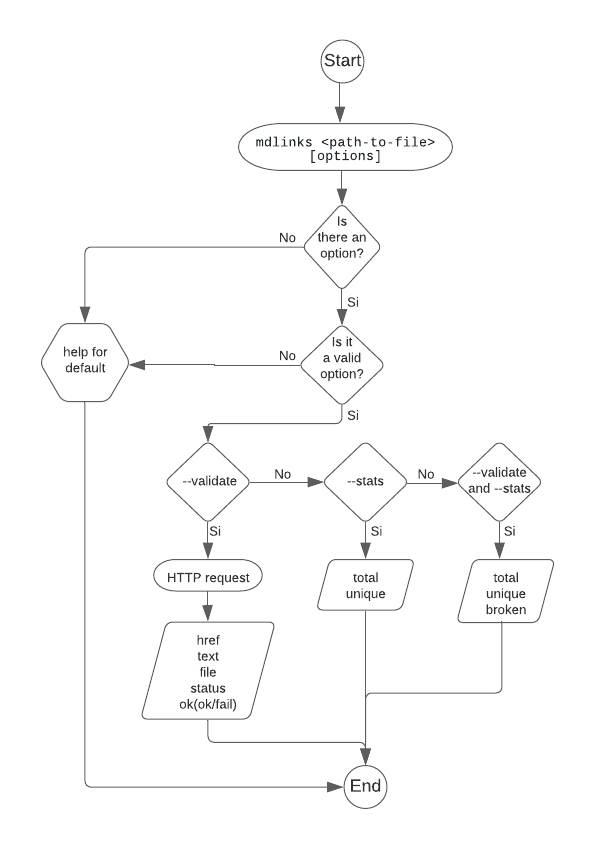

# Markdown Links


Md-links is a library which will help you to validate URLs inside markdown files.
You have four options between you can choose.

## Índice

- [1. Preamble](#1-preamble)
- [2. Installation](#2-installation)
- [3. How to use it](#3-how-to-use-it)
- [4. Structure of the Project](#4-structure-of-the-project)
- [5. Resources used in this project](#5-resources-used-in-this-project)
- [6. Author](#10-author)

---

## 1. Preamble

[Markdown](https://es.wikipedia.org/wiki/Markdown) is a language very used by developers. It can contain a lot of links, and sometimes those links can be broken. So, "Laboratoria" propost us to make a program which helps us to obatin the information needed of those links.

This is the main reason of this library.

Feel free to use it and send me feedback. It will be appreciated.
un lenguaje de marcado


## 2. Installation

You can install it by npm:

```
$ npm i elanny-md-links
```

And now you can start to use it.

## 3. How to use it

Once installed you can run it in the terminal.

```
mdlinks-checker <path-to-file> [options]
```

About `<path-to-file>`, you can enter a relative or a absolute path.

About `[options]`, you can choose between `--help`, `--validate`, `--stats`, or the last two together.

## 4. Structure of the Project

This project const of two part API and CLI.

### 1) JavaScript API

#### `mdLinks(path, options)`

#### FlowChart



You need to enter the following, with the path you want to check:

```
md-links <path-to-file>
```

#### **Output**

For Default it is `validate:false` :

- `href`: URL found.
- `text`: Text that appears inside the link (`<a>`).
- `file`: Path of the file where the link was found.

So the output will be:

```sh
$ md-links ./some/example.md
href: http://google.com/
text: Google
file: ./some/example.md
```

### 2) CLI (Command Line Interface)

#### FlowChart



As above you enter md-links and the path. However, you can choose between `--validate`, `--stats`, `--validate --stats` or `--stats --validate`.

```
md-links <path-to-file> [options]
```

### Options

#### `--validate`

If you enter `--validate`, it will make an HTTP request. So the output will be the following:

```sh
$ md-links ./some/example.md --validate
href: http://google.com/
text: Google
file: ./some/example.md
status: 200
message: OK

```

Or

```sh
$ md-links ./some/example.md --validate
href: https://otra-cosa.net/algun-doc.html
text: algún doc
file: ./some/example.md
status: 404
message: FAIL

```

### `--stats`

If you enter `--stats` the output will be a text with statistics
basics about links.

The Output will be:

```sh
$ md-links ./some/example.md --stats
Total: 3
Unique: 3
```

### `--validate --stats` or `--stats --validate`

You can use `--stats` y `--validate` together to get statistics they need from the validation results.

```sh
$ md-links ./some/example.md --stats --validate
Total: 3
Unique: 3
Broken: 1
```

## 5. Resources used in this project

- Node.js
  - NPM - Manage packages
  - [File system](https://nodejs.org/api/fs.html)
  - [Path](https://nodejs.org/api/path.html)
  - [Process - Documentación oficial (en inglés)](https://nodejs.org/api/process.html)
- ES Modules - Handle modules
- node-fetch - Make HTTP calls
- Chalk - Used to style terminal output
- Figlet - Generate banner
- GitHub: projects

## 6. Author

Elanny Torres

- [GitHub](https://github.com/ElannyTorres)
